*Niniejsza analiza stanowi wzór projektu z przedmiotu pjr na kierunku ab*

# Wprowadzenie

Celem projektu jest eksploracja danych o strzelaninach w szołach w USA w latach 1999-2018. Dane na ten temat zostały zebrane przez dziennikarzy *The Washington Post* i udostępnione w [tym artykule](https://www.washingtonpost.com/graphics/2018/local/school-shootings-database/?utm_term=.e4c8eb7e8ad0). Dane skladają się z 217 rekordów i 50 zmiennych. Każdy rekord dotyczy pojedynczej strzelaniny.

## Obróbka danych

Dane wczytano bezpośrednio z [repozytorium githuba The Washington Post](https://github.com/washingtonpost/data-school-shootings). Po wczytaniu okazało się, że część zmiennych wymaga dodatkowej obróbki, m.in. w niektórych zmiennych liczbowych należało usunąć przecinki. Dodatkowo z kolumny z datami wydobyto dzień i miesiąc.


```r
shootings <- read.csv("https://raw.githubusercontent.com/washingtonpost/data-school-shootings/master/school-shootings-data.csv")
# enrollment i white zostaly potraktowane jako factory,
# poniewaz w niektorych rekordach maja przecinki oddzielajace zcesci tysieczne
# usunmt je i zamienmy na wartosci numeryczne
# funkcja gsub wyszukuje wzorca i zamienia na inny
# (w tym wypadku wyszukam przecinkow i zamienie je na pusty ciag znakow)
shootings$enrollment <- as.numeric(gsub(',', '', shootings$enrollment))
shootings$white <- as.numeric(gsub(',', '', shootings$white))

# faktorami sa tez daty, zamienie je na znaki, a potem utworze dodatkowe 
# kolumny z miesiacem, dniem i rokiem osobno, kolumny z rokiem sie
# pozbede, bo juz taka jest
shootings <- shootings %>% 
  separate(date, into=c("month", "day", "year2"), sep='/', remove = FALSE) %>% 
  select(-year2)
```

Ostatecznie okazało się to niepotrzebne, ponieważ w analizie nie użyto tych zmiennych.

## Wykorzystane zmienne

W dalszej analizie wykorzystano następujące zmienne:  

| Zmienna             | Opis          
| --------------------|:-------------------------------------------
| *year*              | rok strzelaniny
| *day_of_week*       | dzień tygodnia      
| *state*             | stan
| *killed*            | liczba zabitych
| *injured*           | liczba rannych
| *casualties*        | liczba ofiar (zabici + ranni)
| *shooting_type*     | rodzaj ataku (celowy, przypadkowy)
| *age_shooter1*      | wiek atakującego
| *gender_shooter1*   | płeć atakującego
| *resource_officer*  | obecność ochroniarza (0 - brak, 1 - obecny)

Statystyki podsumowujące wybrane zmienne przedstawiają się następująco:


```r
library(knitr)
kable(
  shootings %>% select(state, killed, injured, casualties, age_shooter1) %>% summary
)
```

                state         killed           injured         casualties      age_shooter1 
---  -------------------  ----------------  ---------------  ---------------  --------------
     California    : 27   Min.   : 0.0000   Min.   : 0.000   Min.   : 0.000   Min.   : 6.00 
     Florida       : 17   1st Qu.: 0.0000   1st Qu.: 0.000   1st Qu.: 1.000   1st Qu.:15.00 
     Texas         : 13   Median : 0.0000   Median : 1.000   Median : 1.000   Median :16.00 
     North Carolina: 11   Mean   : 0.6037   Mean   : 1.258   Mean   : 1.862   Mean   :19.21 
     Illinois      : 10   3rd Qu.: 1.0000   3rd Qu.: 1.000   3rd Qu.: 2.000   3rd Qu.:18.00 
     Louisiana     : 10   Max.   :26.0000   Max.   :21.000   Max.   :34.000   Max.   :56.00 
     (Other)       :129   NA                NA               NA               NA's   :40    

Zmienne, które nie zostały tutaj uwzględnione, będą podsumowane w dalszej części analizy.

# Analiza

Przeprowadzona analiza obejmowała następujące zagadnienia:

* analizę czasową - m.in. liczbę strzelanin w poszczgólnych latach, liczbę zabitych i rannych,
* analizę przestrzenną - z podziałem na poszczególne stany w USA,
* analizę sprawców - wiek, płeć, rodzaj ataku,
* obecność ochroniarza.

## Analiza czasowa

Celem tej analizy jest sprawdzenie, czy można zaobserwować jakieś wzorce związane z czasem.


```r
### grupowanie po roku ####
# sprawdze:
# - liczbe zdarzen
# - sume zabitych
# - sume rannych
# - przecietny wiek strzelajacego
shootings.year <- shootings %>% group_by(year) %>% 
  summarize(n = n(), kill = sum(killed), inj = sum(injured),
            mean.age = mean(age_shooter1, na.rm=TRUE))
```

### Liczba zdarzeń


```r
### liczba zdarzen ####
shootings.year %>% ggplot(aes(x=as.factor(year), y=n)) + 
  geom_col(color='black', fill='darkgrey') + 
  theme_minimal() + ggtitle('Number of shootings in each year') + 
  labs(x = '', y = '') + 
  geom_hline(yintercept = mean(shootings.year$n), color='red', lty=2)
```

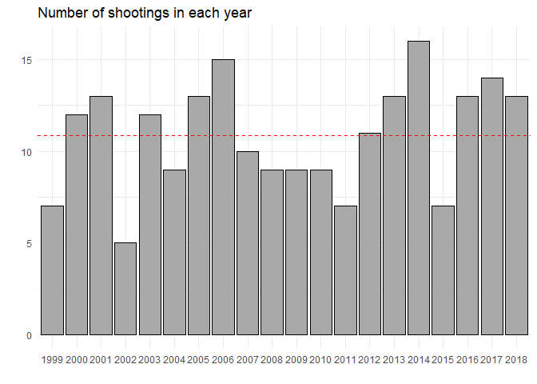<!-- -->

Nie widać żadnej tendencji rozwojowej (trendu). Niepokojący jednak jest wynik z roku 2018 - pomimo, że upłynęła dopiero 1/3 roku, to liczba zdarzeń już przekroczyła średnią z ostatnich 20 lat (zanaczona czerwoną linią).

### Liczba zabitych i rannych


```r
shootings.year %>% ggplot(aes(x=as.factor(year), y=kill)) + 
  geom_col(color='black', fill='darkgrey') + 
  theme_minimal() + ggtitle('Number of killed in each year') + 
  labs(x = '', y = '') +
  geom_hline(yintercept = mean(shootings.year$kill), color='red', lty=2)
```

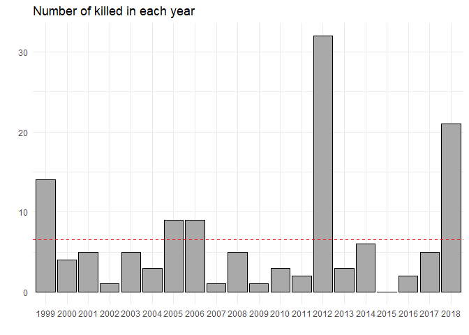<!-- -->


```r
### liczba rannych ####
shootings.year %>% ggplot(aes(x=as.factor(year), y=inj)) + 
  geom_col(color='black', fill='darkgrey') + 
  theme_minimal() + ggtitle('Number of injured in each year') + 
  labs(x = '', y = '') +
  geom_hline(yintercept = mean(shootings.year$inj), color='red', lty=2)
```

<!-- -->

Podobnie jak poprzednio, nie widać tendencji rozwojowych, ale niepokoi liczba ofiar w bieżącym roku, znacznie przewyższająca średnią. Liczba rannych podczas strzelanin w 2018 już jest najwyższa od dwudziestu lat.

### Średnia wieku sprawców


```r
### sredni wiek ####
shootings.year %>% ggplot(aes(x=as.factor(year), y=mean.age)) + 
  geom_col(color='black', fill='darkgrey') + 
  theme_minimal() + ggtitle('Average age of shooter in each year') + 
  labs(x = '', y = '')
```

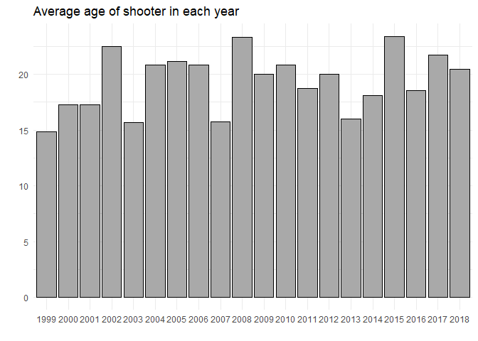<!-- -->


```r
### wiek ####
shootings %>% ggplot(aes(x=as.factor(year), y=age_shooter1)) + 
  geom_boxplot(color='black', fill='darkgrey') + 
  theme_minimal() + ggtitle('Age of shooter in each year') + 
  labs(x = '', y = '')
```

<!-- -->


Tutaj także nie widać żadnego trendu, choć rozkłady wieku w poszczególnych latach wydają się w większości prawoskośne (co jest dosyć oczywiste, biorąc pod uwagę analizowane zagadnienie). Ostatni wykres pokazuje też ciekawy fakt - mianowicie to, że sprawcami nie zawsze są uczniowie, ale również ludzie w dojrzałym wieku.


### Dzień tygodnia

W tym miejscu sprawdzono liczbę strzelanin z podziałem na poszczególne dni tygodnia.


```r
### grupowanie po dniu tygodnia ####
# sprawdze:
# - liczbe zdarzen
# - sume zabitych
# - sume rannych

# ale najpierw ustalam porzadek dni, bo domyslny byl zly
shootings$day_of_week <- factor(shootings$day_of_week, 
                                levels=c('Monday', 'Tuesday',
                                         'Wednesday', 'Thursday',
                                         'Friday'))
# grupuje
shootings.weekday <- shootings %>% group_by(day_of_week) %>% 
  summarize(n = n(), kill = sum(killed), inj = sum(injured))
```


```r
# wykres
shootings.weekday %>% ggplot(aes(x=day_of_week, y=n)) + 
  geom_col(color='black', fill='darkgrey') + 
  theme_minimal() + ggtitle('Number of shootings by weekday') + 
  labs(x = '', y = '')
```

<!-- -->

```r
# raczej pierwsza polowa tygodnia
```

Wykres pokazuje, że bardziej "niebezpieczna" jest pierwsza połowa tygodnia, choć różnice nie są znaczące.


## Analiza przestrzenna

W tej części opracowania została przeprowadzona analiza z podziałem na stany. 


```r
### tworze nowa ramke z grupowaniem po stanie ####
# tym razem sprawdzam:
# - liczbe zdarzen
# - sume zabitych
# - sume rannych
shootings.state <- shootings %>% group_by(state) %>% 
  summarize(n = n(), kill = sum(killed), inj = sum(injured))
```


### Liczba strzelanin


```r
### liczba zdarzen ####
shootings.state %>% ggplot(aes(x=state, y=n)) + 
  geom_col(color='black', fill='darkgrey') + 
  theme_minimal() + ggtitle('Number of shootings in each state') + 
  labs(x = '', y = '') + coord_flip() +
  scale_x_discrete(limits = rev(levels(shootings.state$state)))
```

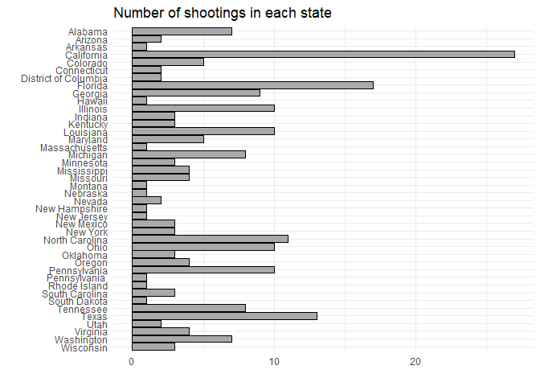<!-- -->

Z wykresu wynika, że w liczbie strzelanin zdecydowanie przodują California, Floryda i Texas, ale też to właśnie te stany mają największą populację ([źródło](https://en.wikipedia.org/wiki/List_of_U.S._states_and_territories_by_population)), więc być może nie ma się czemu dziwić. Chociaż już czwarty pod względem populacji stan Nowy York odnotowuje niską liczbę incydentów. Z wykresu można też odczytać, że w jednym rekordzie stan Pennsylvania zostal wprowadzony ze spacją na końcu.

### Liczba zabitych


```r
### suma zabitych ####
shootings.state %>% ggplot(aes(x=state, y=kill)) + 
  geom_col(color='black', fill='darkgrey') + 
  theme_minimal() + ggtitle('Number of killed in each state') + 
  labs(x = '', y = '') + coord_flip() +
  scale_x_discrete(limits = rev(levels(shootings.state$state)))
```

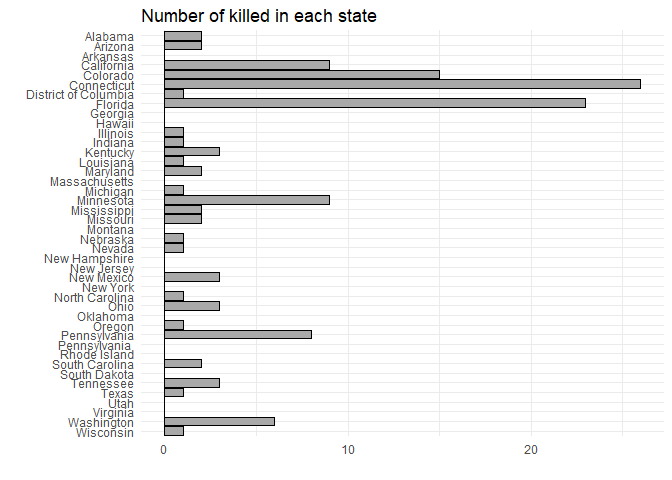<!-- -->

Tutaj z kolei przodują stany Connecticut i Floryda. Najprawdopodobniej to właśnie tam miały miejsce najtragiczniejsze w skutkach strzelaniny. Żeby to sprawdzić, poniżej przedstawiono dane o liczbie zabitych z podziałem na poszczególne incydenty (dla czytelności dołożono lekki szum losowy, żeby punkty nie nakładały się bezpośrednio na siebie). 


```r
### liczba zabitych ####
# wykres punktowy z lekkim szumem losowym w poziomie,
# dokladne wartosci nie sa potrzebne, a tak bedzie lepiej widac
shootings %>% ggplot(aes(x=state, y=killed)) + 
  geom_jitter(width=0, size=2, alpha=0.5) + 
  theme_minimal() + ggtitle('Number of killed in each shooting') + 
  labs(x = '', y = '') + coord_flip() +
  scale_x_discrete(limits = rev(levels(shootings.state$state))) +
  geom_label_repel(aes(label=ifelse(shootings$killed>4, shootings$year, '')))
```

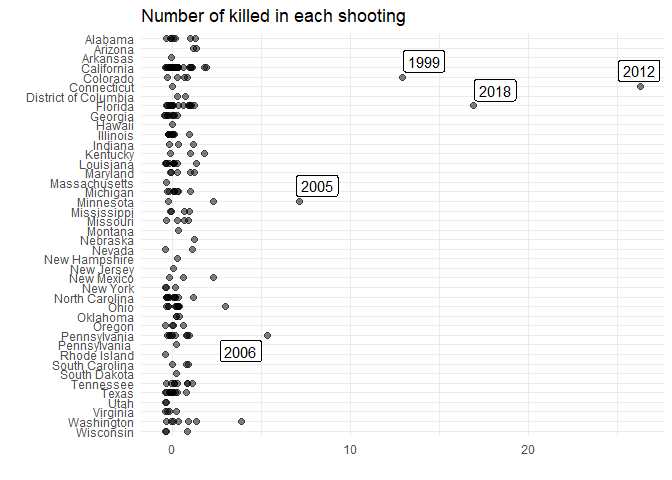<!-- -->

Z wykresu wynika, że rzeczywiście w Connecticut i na Florydzie miały miejsce strzelaniny z największą liczbą śmiertelnych ofiar.

### Liczba rannych

W podobny sposób sprawdzono liczbę rannych w poszczególnych stanach.


```r
shootings.state %>% ggplot(aes(x=state, y=inj)) + 
  geom_col(color='black', fill='darkgrey') + 
  theme_minimal() + ggtitle('Number of injured in each state') + 
  labs(x = '', y = '') + coord_flip() +
  scale_x_discrete(limits = rev(levels(shootings.state$state)))
```

<!-- -->

Tutaj zdecydowanie przoduje California (zapewne ze względu na liczbę incydentów). Poniżej poszczególne strzelaniny z podziałem na stany.


```r
shootings %>% ggplot(aes(x=state, y=injured)) + 
  geom_jitter(width=0, size=2, alpha=0.5) + 
  theme_minimal() + ggtitle('Number of injured in each shooting') + 
  labs(x = '', y = '') + coord_flip() +
  scale_x_discrete(limits = rev(levels(shootings.state$state))) +
  geom_label_repel(aes(label=ifelse(shootings$injured>9, shootings$year, '')))
```

<!-- -->

Okazuje się, że najwięcej rannych zostało w trakcie strzelaniny w Colorado w 1999 roku. Na drugim miejscu natomiast jest niedawna strzelanina na Florydzie.

## Analiza sprawców

W tym miejscu analizę eksploracyjną skoncentrowano na sprawcach i typach ataków. Sprawdzono wiek oraz płeć sprawców, a także liczbę ofiar biorąc pod uwagę charakter ataku.

### Wiek

W poniższym wykresie wykluczono sprawców, których wiek nie został określony.


```r
### histogram wieku ####
shootings %>% ggplot(aes(x = age_shooter1)) + 
  geom_histogram(boundary=0.5, fill='darkgrey', color='black', binwidth = 1) +
  geom_vline(xintercept = median(shootings$age_shooter1, na.rm=TRUE),
             color= 'red', lty=2, size=1.2) + 
  theme_minimal() + ggtitle('Distribution of shooters\' age') + 
  labs(x = '', y = '') + 
  annotate(geom='text', x=22, y=30, color = 'red', size=5,
           label=paste0('Median = ',median(shootings$age_shooter1, 
                                           na.rm=TRUE)))
```

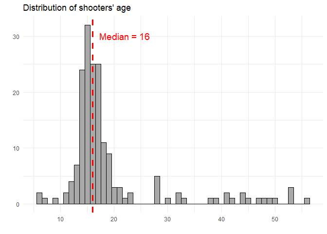<!-- -->

Histogram wieku pokazuje prawostronną skośność jego rozkładu. Mediana wieku sprawców wynosi 16 lat (co jest zgodne z [artykułem z The Washington Post](https://www.washingtonpost.com/graphics/2018/local/school-shootings-database/?utm_term=.e4c8eb7e8ad0)). Najczęściej występującym wiekiem jest 15 lat.


### Płeć


```r
shootings.gender <- shootings %>% group_by(gender_shooter1) %>% 
  summarise(n = n())
shootings.gender$gender_shooter1 <- factor(shootings.gender$gender_shooter1,
                                           levels=c('', 'f', 'm'),
                                           labels=c('nieznana', 'K', "M"))

kable(shootings.gender, col.names=c('płeć', 'liczba ataków'))
```


płeć        liczba ataków
---------  --------------
nieznana               14
K                      10
M                     193

Jak pokazuje powyższe podsumowanie, zdecydowana większość ataków była przeprowadzona przez mężczyzn.

### Rodzaj ataku


```r
kable(sort(table(shootings$shooting_type), decreasing = TRUE),
      col.names=c('rodzaj ataku', 'liczebność'))
```


rodzaj ataku                   liczebność
----------------------------  -----------
targeted                              130
indiscriminate                         42
accidental                             26
targeted and indiscriminate             5
public suicide                          4
unclear                                 4
accidental or targeted                  2
hostage suicide                         2
                                        1
public suicide (attempted)              1

Zdecydowanie przważają ataki celowe (*targeted*, czyli z checią zabicia konkretnych osób), oprócz tego jeszcze często zdarzały się przypadki określone jako *indiscriminate* (strzelanie bez konkretnych celów) i strzały przypadkowe (*accidental*). Te trzy typy strzelanin zostały wzięte pod uwagę w dalszej analizie.

#### Liczba zabitych


```r
# liczba zabitych
shootings %>% 
  filter(shooting_type %in% c('targeted', 'indiscriminate', 'accidental')) %>% 
  ggplot(aes(x=shooting_type, y=killed)) + 
  geom_boxplot(color='black', fill='darkgrey') + 
  theme_minimal() + ggtitle('Number of killed') + 
  labs(x = '', y = '')
```

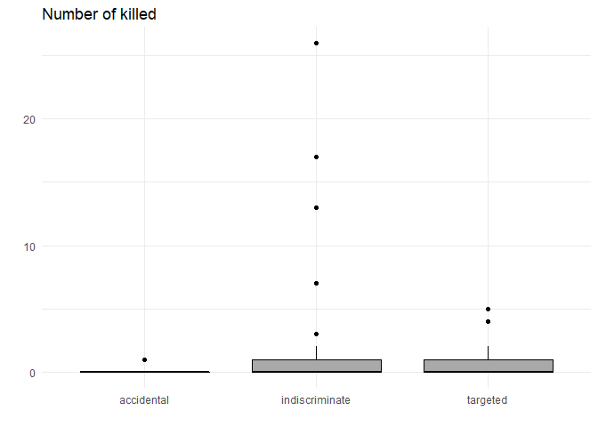<!-- -->

Przypadkowe strzelaniny (albo raczej wystrzały) rzadko są przyczyną śmierci. Najbardziej zabójcze wydają się ataki określone jako *indiscriminate*.

#### Liczba rannych


```r
# liczba rannych
shootings %>% 
  filter(shooting_type %in% c('targeted', 'indiscriminate', 'accidental')) %>% 
  ggplot(aes(x=shooting_type, y=injured)) + 
  geom_boxplot(color='black', fill='darkgrey') + 
  theme_minimal() + ggtitle('Number of injured') + 
  labs(x = '', y = '')
```

<!-- -->

Pomimo takiej samej mediany, wyraźnie widać, że ataki typu *indiscriminate* skutkują największą liczbą rannych. Co ciekawe, liczba rannych w strzelaninach celowych i przypadkowych jest zbliżona (a nawet większość ataków celowych skutkuje mniejszą liczbą rannych). Poniżej sprawdzono jeszcze liczbę wszystkich ofiar z podziałem na typy strzelanin.

#### Liczba ofiar ogółem


```r
# liczba ofiar ogolem
shootings %>% 
  filter(shooting_type %in% c('targeted', 'indiscriminate', 'accidental')) %>% 
  ggplot(aes(x=shooting_type, y=casualties)) + 
  geom_boxplot(color='black', fill='darkgrey') + 
  theme_minimal() + ggtitle('Number of casualties (killed + injured)') + 
  labs(x = '', y = '') 
```

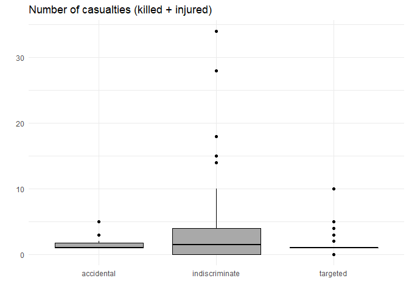<!-- -->

Potwierdza się wcześniejszy wniosek o tym, że najbardziej tragiczne w skutkach są ataki typu *indiscriminate*. Za pomocą testu *Kruskala-Wallisa* sprawdzono statyczną istotność różnicy w rozkładach ofiar poszczególnych typów strzelanin: $H_0$ - rozkłady (a dokładniej mediany rozkładów) są takie same, $H_1$ - rozkłady są różne.


```r
shootings.filter.type <- shootings %>% 
  filter(shooting_type %in% c('targeted', 'indiscriminate', 'accidental')) 
# test
kruskal.test(casualties ~ shooting_type, shootings.filter.type)
```

```
## 
## 	Kruskal-Wallis rank sum test
## 
## data:  casualties by shooting_type
## Kruskal-Wallis chi-squared = 7.2317, df = 2, p-value = 0.02689
```

Ponieważ *p-value* < 0.05 można odrzucić hipotezę $H_0$ i przyjąć hipotezę, że rozkłady liczby ofiar tych ataków są rzeczywiście różne. 

#### Wiek sprawców


```r
# wiek strzelajacych
shootings %>% 
  filter(shooting_type %in% c('targeted', 'indiscriminate', 'accidental')) %>% 
  ggplot(aes(x=shooting_type, y=age_shooter1)) + 
  geom_boxplot(color='black', fill='darkgrey') + 
  theme_minimal() + ggtitle('Shooters\' age') + 
  labs(x = '', y = '')
```

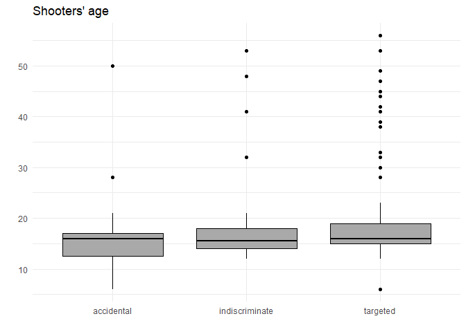<!-- -->

Wydaje się, ze istnieje związek między wiekiem a typem strzelaniny - te celowe są przeprowadzane przez starszych, a te przypadkowe - przez młodszych (choć mediany tego nie pokazują, ale wykresy pudełkowe już tak). 

Sprawdzono średnią wieku sprawców ze względu na typ strzelaniny:


```r
kable(
  shootings %>% 
  filter(shooting_type %in% c('targeted', 'indiscriminate', 'accidental')) %>% 
  group_by(shooting_type) %>% 
  summarise(mean.age = round(mean(age_shooter1, na.rm=TRUE),2)),
  col.names=c('rodzaj incydentu', 'średni wiek')
)
```


rodzaj incydentu    średni wiek
-----------------  ------------
accidental                16.95
indiscriminate            18.50
targeted                  20.18

Różnice w średnim wieku sprawców są wyraźne, ale ze względu na stosunkowo niewielką liczbę ataków innych niż *targeted* mogą okazać się nieistotne statystycznie. Podobnie jak poprzednio, wykorzystamy test *Kruskala-Wallisa* (anova zakłada normalność rozkładów, której nie sprawdzono, natomiast test *t-studenta* - w tym przypadku należałoby zastosować wielokrotny test - możliwy jest tylko dla dużych prób, a ataków typu *accidental* jest mniej niż 30).


```r
kruskal.test(age_shooter1 ~ shooting_type, shootings.filter.type)
```

```
## 
## 	Kruskal-Wallis rank sum test
## 
## data:  age_shooter1 by shooting_type
## Kruskal-Wallis chi-squared = 3.6636, df = 2, p-value = 0.1601
```

Uzyskana wartość *p-value* (0.16) nie pozwala na odrzucenie hipotezy $H_0$ (czyli nie można stwierdzić, że wiek sprawców poszczególnych typów ataków jest statystycznie różny).


## Obecność ochroniarza

Ostatnim rodzajem analizy jest sprawdzenie, czy można zaobserwować związek między obecnością ochroniarza a liczbą ataków i ofiar.


```r
kable(
  shootings %>% group_by(resource_officer) %>% 
  summarize(n = n(), kill = sum(killed), inj = sum(injured)),
  col.names=c('ochroniarz obecny', 'liczba strzelanin', 'liczba zabitych', 
              'liczba rannych')
)
```


 ochroniarz obecny   liczba strzelanin   liczba zabitych   liczba rannych
------------------  ------------------  ----------------  ---------------
                 0                 143                68              130
                 1                  74                63              143

I to dość ciekawe - dwa razy mniej strzelanin, gdy ochroniarz jest obecny, ale liczba zabitych i rannych jest podobna. Może to oznaczać (ale to tylko przypuszczenie), że obecność ochroniarza odstrasza potencjalnych sprawców, ale jeśli pomimo jego obecności zdecydują się na atak, to są do niego lepiej przygotowani. 

Poniżej rysunek pokazujący liczbę ofiar (*casualties*) w poszczególnych strzelaninach (dla większej czytelności pominięto jeden incydent z Hawajów) z uwzględnieniem obecności ochroniarza (niebieski punkt - obecny, czerwony - nieobecny, wielkość punktu określa liczbę ofiar).


```r
library(maps)
library(ggmap)

# wykluczam Hawaje
sh <- shootings %>% filter(long > -140)
# wczytuje dane mapy
us <- map_data("state")

ggplot() +
  geom_map(data=us, map=us, aes(x=long, y=lat, map_id=region), 
           fill='lightgrey', color='black') +
  geom_point(data=sh, aes(x=long, y=lat, size=casualties,
                          fill=as.factor(resource_officer)),
             alpha=0.8, color='black', shape=21) +
  theme_void() +
  theme(legend.position = 'none') + 
  ggtitle('Number of casulties with (blue) and without (red) resource officer') +
  facet_wrap(~year)
```

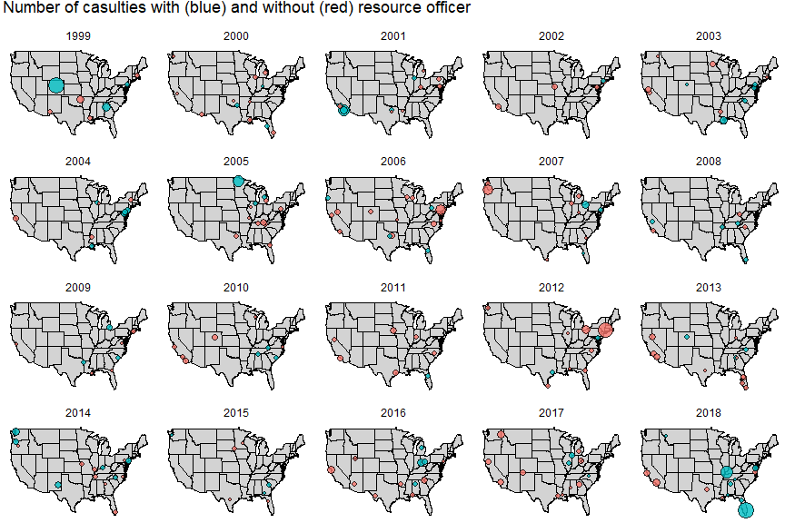<!-- -->

Z wykresu wynika, że większość najtragiczniejszych strzelanin miała miejsce przy obecności ochroniarza.

# Wnioski

1. Analiza czasowa nie wykazuje żadnych tendencji rozwojowych. Na uwagę zasługuje jednak fakt, że rok 2018, pomimo, że nie minęła jeszcze nawet jego połowa, jest już rekordowy pod względem liczby rannych.
2. Najwięcej strzelanin wydarzyło się w pierwszej połowie tygodnia.
3. Pomimo tego, że trzy stany o największej populacji przodują jeśli chodzi o liczbę strzelanin, to liczba incydentów nie jest wprost proporcjonalna do liczebności stanu. Stąd można przypuszczać, że na prawdopodobieństwo wystąpienia strzelaniny w danym stanie wpływ mają inne czynniki.
4. Jeżeli chodzi o liczbę rannych i zabitych w poszczególnych stanach, to wykrycie ewentualnych prawidłowości utrudniają obserwacje skrajne (takie jak strzelaniny w Connecticut w 2012 roku czy na Florydzie w 2018).
5. Mediana wieku sprawców wynosi 16 lat, najwięcej strzelanin było spowodowanych przez osoby w wieku 15 lat. Zdecydowana większość sprawców jest płci męskiej.
6. Najwięcej ofiar spowodowały nieprzypadkowe ataki bez określonego celu.
7. Większość incydentów miało miejsce w szkołach, w których nie było ochroniarza. Jednak ataki, które nastąpiły przy obecności ochroniarza, były w swoich skutkach (przeciętnie) bardziej tragiczne.

# Co dalej?

Dalsze analizy mogłyby uwzględnić:

* sprawdzenie, czy jakieś szkoły się powtarzają,
* analizę strukturę uczniów szkołach (także tych, w których nie doszło do ataków, co wymagałoby jednak pozyskania dodatkowych danych),
* analizę rodzaju i pochodzenia broni (choć tutaj dane są trudniejsze do obróbki),
* próbę budowy modelu statystycznego, którego celem byłoby określenie prawdopodobieństwo wystąpienia ataku w danej szkole (należałoby wykluczyć przypadki skrajne oraz najprawdopodobniej skorzystać z dodatkowych danych).

